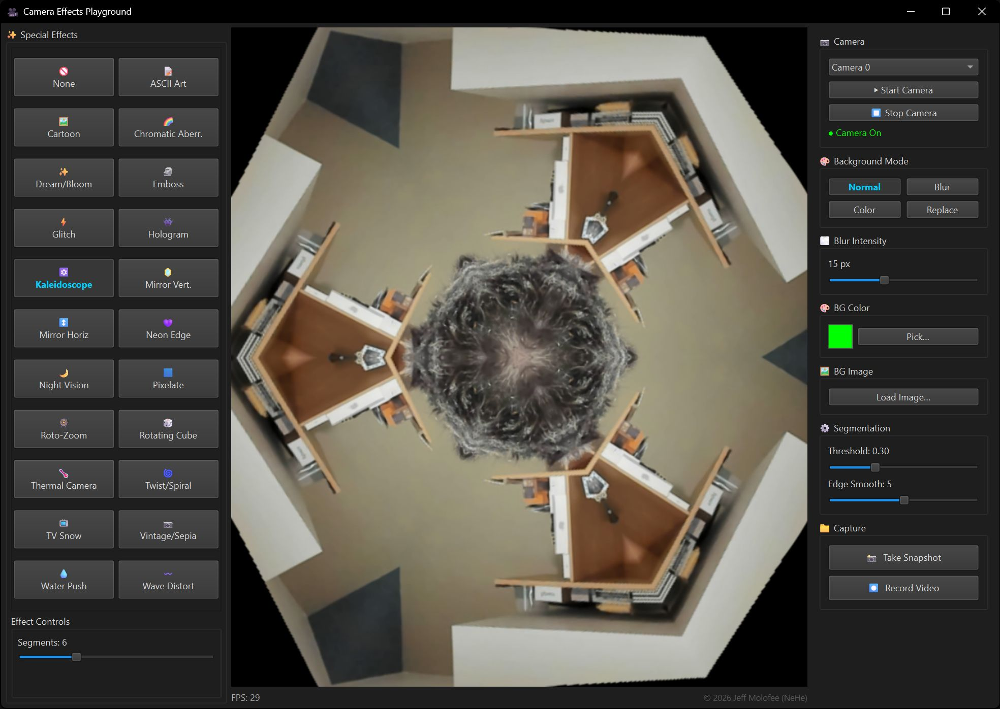

# Camera Effects Playground

**© 2026 Jeff Molofee (NeHe)**

A real-time webcam effects application built with Python, PyQt6, OpenCV, and MediaPipe. All processing runs locally — no browser, no cloud, no external services.

---

## Background

This project evolved through several iterations before reaching its current form.

It began as a **Java application**, exploring what was achievable with real-time webcam manipulation on the desktop. From there it became a **web-based app** using HTML, JavaScript, and WebRTC — portable, but limited by browser sandboxing and the lack of low-level media access.

The final version is a **native Python desktop application**, which struck the right balance between development speed, library ecosystem, and raw performance. The end result is something a non-technical user can launch with a double-click and get 30fps effects immediately.

The project was built alongside my kids, who contributed ideas, tested effects live on the webcam, and helped decide what made the cut. Favourites included TV Snow, Kaleidoscope, and the Rotating Cube.

---

## Features

- Automatic webcam detection with support for multiple camera devices
- **Background replacement** — Blur, Solid Color, and Custom Image modes powered by MediaPipe neural segmentation
- **22 real-time special effects**, each with adjustable parameters:
  - ASCII Art, Cartoon, Chromatic Aberration, Dream/Bloom
  - Emboss, Glitch, Hologram, Kaleidoscope
  - Mirror (Horizontal & Vertical), Neon Edge, Night Vision
  - Pixelate, Rotating Cube, Roto-Zoom, Thermal Camera
  - Twist/Spiral, TV Snow, Vintage/Sepia, Water Push, Wave Distort
- Effects and background modes are mutually exclusive — activating one automatically disables the other
- Snapshot output to PNG
- Video recording to AVI
- Dark-themed UI with clear visual feedback for active selections

---

## Requirements

- Python 3.8 or later
- Dependencies:

```bash
pip install opencv-python numpy PyQt6 mediapipe
```

- The MediaPipe selfie segmentation model (`selfie_segmenter.tflite`) is not included in this repository due to file size. It is downloaded automatically from Google's MediaPipe storage the first time a Background Mode is activated, and saved next to `camera_effects.py` for all future runs.

---

## Running the App

**Windows** — double-click `start.bat`

**Any platform** — run from a terminal:

```bash
python camera_effects.py
```

---

## Project Structure

```
Camera Effects/
├── camera_effects.py        # Application entry point — UI, camera loop, compositing
├── effects_lib.py           # Effect functions and registry
├── selfie_segmenter.tflite  # MediaPipe segmentation model (not included in repo)
├── start.bat                # Windows launcher
├── requirements.txt         # Dependency reference
├── .gitignore
└── README.md
```

---

## Possible Future Improvements

- GPU-accelerated effects via OpenGL/GLSL shaders
- Effect chaining — apply multiple effects simultaneously
- Preset save/load for favourite configurations
- macOS and Linux testing (the PyQt6 stack should be portable with minor adjustments)

---

## License

This is a personal project — use it however you like.

---

<p align="center">
  
</p>
