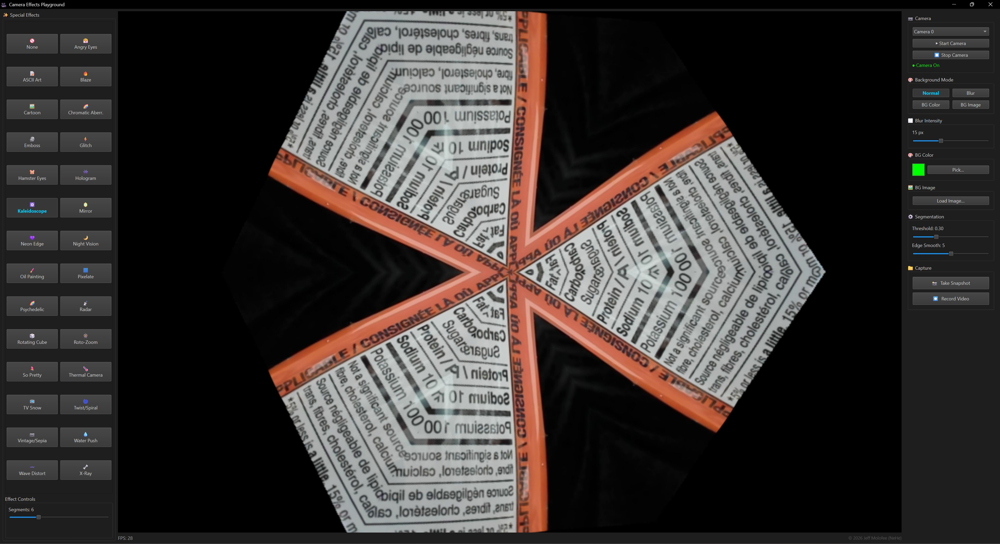

# Camera Effects Playground

**2026 Jeff Molofee (NeHe)**

A real-time webcam effects application built with Python, PyQt6, OpenCV, and MediaPipe. All processing runs locally — no browser, no cloud, no external services.

---

## What's New in v1.0.2

- **Added: Sid Eyes** — pushes the eyes outward toward the sides of the head via face landmarks, sloth-stare style, using a thin-plate-spline face warp
- **Improved: Hamster Eyes** — reworked with the same thin-plate-spline technique as Sid Eyes instead of the original constant-factor spherical bulge, for smoother, more natural eye enlargement with no ring artifacts
- **Fixed: frame backlog** — the capture thread now skips emitting a new frame while the previous one is still being processed, so a slow effect can no longer queue up a growing backlog and lag the feed

## What's New in v1.0.1

- **Hologram** — dual independent energy bands now sweep across the frame at random intervals and directions (previously only one band)
- **Hologram** — row-jitter now uses phase drift and random glitch bands for a more organic, non-repeating shimmer
- **Hologram** — Scan Speed slider minimum lowered to 0 so venetian blinds can be frozen completely
- **Added: Angry Eyes** — V-shaped brows + red eye tint driven by MediaPipe face landmarks
- **Added: Hamster Eyes** — comically enlarged eyes using spherical-bulge warp via face landmarks
- **Added: So Pretty** — glamour makeup overlay (blush, eyeliner, lip colour) via face landmarks
- **Added: X-Ray** — inverted bone-scan look with blue-white tint and unsharp-mask detail boost
- **Added: Blaze** — heat shimmer warp + fire palette (renamed from Infrared)
- **Added: Psychedelic** — per-pixel hue cycling driven by luminance, with animated offset
- **Added: Oil Painting** — real-time brush strokes via `cv2.xphoto.oilPainting`
- **Added: Radar** — phosphor-green sweep scope with fading trail and animated reticle
- **Added: Wave Distort** — whole-frame sloshing + rolling rotation warp
- **Removed: Dream/Bloom** — replaced by the more capable Blaze and Oil Painting effects

---

## Background

This project evolved through several iterations before reaching its current form.

It began as a **Java application**, exploring what was achievable with real-time webcam manipulation on the desktop. From there it became a **web-based app** using HTML, JavaScript, and WebRTC — portable, but limited by browser sandboxing and the lack of low-level media access.

The final version is a **native Python desktop application**, which struck the right balance between development speed, library ecosystem, and raw performance. The end result is something a non-technical user can launch with a double-click and get 30fps effects immediately.

The project was built alongside my kids, who contributed ideas, tested effects live on the webcam, and helped decide what made the cut. Favourites included TV Snow, Kaleidoscope, and the Rotating Cube.

---

## Features

- Automatic webcam detection with support for multiple camera devices
- **Background replacement** — Blur, Solid Color, and Custom Image modes powered by MediaPipe neural segmentation
- **28 real-time special effects** (plus None), each with adjustable parameters:
  - Angry Eyes, ASCII Art, Blaze, Cartoon, Chromatic Aberration
  - Emboss, Glitch, Hamster Eyes, Hologram, Kaleidoscope
  - Mirror (Horizontal & Vertical), Neon Edge, Night Vision, Oil Painting
  - Pixelate, Psychedelic, Radar, Rotating Cube, Roto-Zoom
  - So Pretty, Sid Eyes, Thermal Camera, Twist/Spiral, TV Snow
  - Vintage/Sepia, Water Push, Wave Distort, X-Ray
- Effects and background modes are mutually exclusive — activating one automatically disables the other
- Snapshot output to PNG
- Video recording to AVI
- Dark-themed UI with clear visual feedback for active selections

---

## Requirements

- Python 3.8 or later
- Dependencies (installed automatically by `install.bat` — see below):

```bash
pip install opencv-python opencv-contrib-python numpy PyQt6 mediapipe
```

- The MediaPipe face landmarker model (`face_landmarker.task`) is not included in this repository due to file size. It is downloaded automatically from Google's MediaPipe storage the first time a face-landmark effect (Hamster Eyes, Angry Eyes, So Pretty, Sid Eyes) is activated, and saved next to `camera_effects.py` for all future runs.

---

## Running the App

**Windows** — double-click `start_app.bat`

If `.venv` isn't set up yet, `start_app.bat` automatically triggers `install.bat` first, which creates a local `.venv` and installs all dependencies from `requirements.txt`, then launches the app. You can also run `install.bat` directly ahead of time if you just want dependencies installed without launching the app.

**Any platform** — run from a terminal:

```bash
python camera_effects.py
```

---

## Project Structure

```
Camera Effects/
├── camera_effects.py        # Application entry point — UI, camera loop, compositing
├── effects_lib.py           # Effect functions and registry
├── face_landmarker.task     # MediaPipe face landmark model (not included in repo)
├── start_app.bat            # Windows launcher (auto-installs into .venv if missing)
├── install.bat              # Creates .venv and installs requirements.txt
├── requirements.txt         # Dependency reference
├── .gitignore
└── README.md
```

---

## Possible Future Improvements

- GPU-accelerated effects via OpenGL/GLSL shaders
- Effect chaining — apply multiple effects simultaneously
- Preset save/load for favourite configurations
- macOS and Linux testing (the PyQt6 stack should be portable with minor adjustments)

---

## License

This is a personal project — use it however you like.

---

<p align="center">
  
</p>
